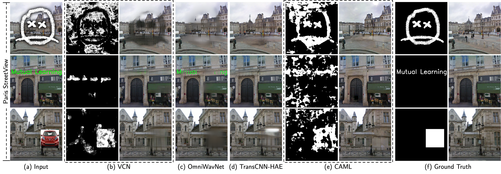

# CAML

This repository provides the official PyTorch implementation of our paper "Context-Aware Mutual Learning for Blind Image Inpainting and Beyond".

## More Results

- Qualitative comparison results of unseen contaminated patterns for blind image inpainting.





## Prerequisites

- Linux
- Python 3.7
- NVIDIA GPU + CUDA CuDNN

## Getting Started


### Installation

- Clone this repo:
```bash
git clone https://github.com/zhenglab/CAML.git
cd CAML
```

- Install [PyTorch](http://pytorch.org) and 1.4 and other dependencies (e.g., torchvision).
  - For Conda users, you can create a new Conda environment using `conda create --name <env> --file requirements.txt`.

### Training

```
python train.py --path=$configpath$

For example: python train.py --path=./checkpoints/
```

### Testing

```
python test.py --path=$configpath$ 

For example: python test.py --path=./checkpoints/
```

### Pre-trained Models

- Download pre-trained models from [BaiduCloud](https://pan.baidu.com/s/1-VzOl35c7NYaUprAwRXoQw?pwd=7qmx) (access code: 7qmx), and put `g.pth` `e.pth` `d.pth` `dp.pth` in the directory `checkpoints`.

